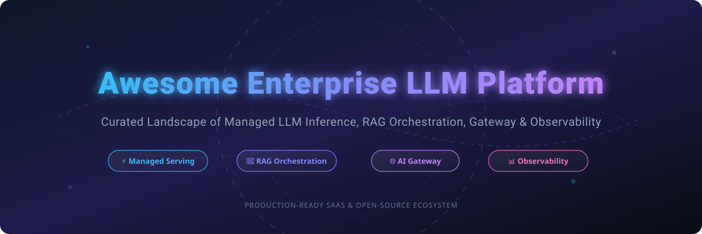

# Awesome Enterprise LLM Platform 🚀

  
  
  
  
  

---

## 📌 Overview & SEO Summary

**Awesome Enterprise LLM Platform** is a comprehensive, production-grade curated list of **SaaS platforms** and **Open-Source GitHub software** for building, deploying, serving, and evaluating Large Language Model (LLM) applications at scale. 

Whether you are an Enterprise AI Architect, MLOps Specialist, AI Engineer, or CTO, this repository provides deep insight into key foundational components of modern AI stacks:
* **Managed Inference Serving & Compute** (AWS Bedrock, Azure OpenAI, GCP Vertex AI, Together AI, Fireworks AI)
* **High-Performance Open-Source LLM Inference** (vLLM, SGLang, TGI, Superlinked SIE)
* **RAG Orchestration & Frameworks** (LangChain, LlamaIndex, Haystack)
* **Open-Source & Cloud AI Gateways** (LiteLLM, Portkey Gateway, Bifrost, Kong AI Gateway)
* **LLM Observability, Tracing & Evaluation** (Langfuse, Phoenix Arize, Portkey)

---

## 📖 Table of Contents

* [☁️ SaaS / Hosted LLM Platforms](#️-saas--hosted-llm-platforms)
* [🔓 Open-Source GitHub Projects](#-open-source-github-projects)
* [🤝 How to Contribute](#-how-to-contribute)
* [💖 Support & Sponsorship](#-support--sponsorship)
* [📈 Star History](#-star-history)
* [⚠️ Disclaimer](#%EF%B8%8F-disclaimer)

---

## ☁️ SaaS / Hosted LLM Platforms

> **📊 Sector Market Size & Dynamics**: The global enterprise LLM platform market is estimated at **~$15 Billion in 2026** and projected to expand towards **~$50 Billion by 2032**. The market is **moderately fragmented**: Cloud hyperscalers (AWS, Azure, GCP) command the largest share for enterprise IT infrastructure, while specialized low-latency inference providers (Together AI, Fireworks AI) win on performance and open model serving. No single platform has achieved a "winner-take-all" monopoly; multi-cloud and hybrid deployments remain standard enterprise architecture.

Below is a curated overview of enterprise SaaS LLM platforms, sorted by **Company Revenue / Valuation (Descending)**:

| Platform | Description | Pricing (Starting Tier) | Free Tier / Trial Limits | Company Size (Revenue / Valuation) |
| :--- | :--- | :--- | :--- | :--- |
| **[AWS Bedrock](https://aws.amazon.com/bedrock/)** ☁️ | **AWS managed foundation model service.** Broadest model selection including Anthropic Claude, Meta Llama, Cohere, and Titan. | Claude 3.5 Sonnet: **$3.00/1M input tokens**, **$15.00/1M output tokens**. Provisioned Throughput available. | **$100–$200 free promotional credits** for new AWS accounts. No perpetual free tier. | **~$638 Billion revenue** (Amazon FY2025) |
| **[Google Cloud Vertex AI](https://cloud.google.com/vertex-ai)** 🌐 | **Google ML platform with Gemini models.** Multimodal LLMs, Model Garden, Vertex AI Search & Conversation. | Gemini 2.5 Flash: **$0.075/1M input tokens**, **$0.30/1M output tokens**. Gemini Pro: **$1.25/1M input**. | **$300 free trial credits for 90 days**. Free rate-limited Gemini API access tier. | **~$350 Billion revenue** (Alphabet FY2025) |
| **[Microsoft Azure OpenAI Service](https://azure.microsoft.com/en-us/products/ai-services/openai-service)** ⚡ | **Managed OpenAI models on Azure.** GPT-4o, o1, and embeddings with enterprise security & compliance. | GPT-4o: **$2.50/1M input tokens**, **$10.00/1M output tokens**. Provisioned Units (PTU): **$2–$3/hour**. | **$200 free credit for 30 days** via Azure Free Account. No perpetual free tier. | **~$281 Billion revenue** (Microsoft FY2025) |
| **[IBM watsonx.ai](https://www.ibm.com/products/watsonx-ai)** 🏢 | **Enterprise AI & data studio.** Foundation models, prompt lab, governance, and hybrid cloud compliance. | watsonx.ai Standard: **~$0.003/1,000 tokens** depending on model size and hosting tier. | **30-day free trial** with 25,000 free units/tokens. No perpetual free tier. | **~$63 Billion revenue** (IBM FY2025) |
| **[Scale AI](https://scale.com/)** 🏷️ | **Data platform for AI.** Managed data labeling, synthetic data generation, and enterprise LLM evaluation. | Enterprise custom pricing; Scale Rapid labeling starts at **~$0.08 per annotation task**. | **Free trial credits** for Scale Rapid self-serve workspace. No perpetual free tier. | **~$14 Billion valuation** (Private enterprise) |
| **[Cohere Platform](https://cohere.com/)** 🧠 | **Enterprise NLP & LLM platform.** Command R+, Embed, and Rerank models with private cloud deployment. | Command R+: **$2.50/1M input tokens**, **$10.00/1M output tokens**. Rerank: **$2.00/1,000 queries**. | **Free Trial Key** with rate limit of 40 API calls/minute. Non-production use only. | **~$5.5 Billion valuation** (Private enterprise) |
| **[Together AI](https://www.together.ai/)** ⚡ | **Fast, scalable open-source model inference.** 200+ open models (Llama, DeepSeek) via OpenAI-compatible API. | Llama 3.3 70B: **$0.88/1M tokens**. Mixtral 8x7B: **$0.60/1M tokens**. DeepSeek R1: **$3.00/1M tokens**. | **$1.00 free credit** on account registration. No perpetual free tier. | **~$3.3 Billion valuation** (Private enterprise) |
| **[Databricks Mosaic AI](https://www.databricks.com/product/machine-learning)** 📊 | **Unified LLM serving & RAG platform.** Foundation Model APIs, Vector Search, and MLflow integrations. | Serverless Model Serving: **$0.07 per DBU** (Data Intelligence Unit). | **14-day full platform free trial**. No perpetual free tier. | **~$3.5 Billion revenue** (FY2025 Est.) |
| **[Anyscale](https://www.anyscale.com/)** 🧮 | **Managed Ray distributed compute platform.** LLM training, fine-tuning, and high-throughput inference serving. | Anyscale Endpoints: **$0.50/1M tokens** for Llama-3-8B. Cloud compute: **$0.10/cluster hr**. | **$100 free compute credits** upon signup. No perpetual free tier. | **~$1.0 Billion valuation** (Private enterprise) |
| **[Fireworks AI](https://fireworks.ai/)** 🎆 | **Ultra-fast inference engine.** Optimized serving for open-source models with JSON mode & tool calling. | Llama 3.1 8B: **$0.20/1M tokens**. Llama 3.1 70B: **$0.90/1M tokens**. Mixtral 8x7B: **$0.50/1M tokens**. | **$1.00 free credit** upon signup. No perpetual free tier. | **~$552 Million total raised** (Private enterprise) |

---

## 🔓 Open-Source GitHub Projects

Below is a curated list of top open-source enterprise LLM projects, sorted by **GitHub Stars (Descending)**:

| Repository & Description | Stars Badge | Approximate Stars |
| :--- | :--- | :--- |
| **[LangChain](https://github.com/langchain-ai/langchain)** — **The standard for building LLM-powered applications.** Framework for agentic workflows on LangGraph runtime, durable state execution, streaming, and human-in-the-loop capabilities. |  | ~110,000 |
| **[vLLM](https://github.com/vllm-project/vllm)** — **High-throughput LLM inference and serving engine.** Features PagedAttention KV cache management, continuous batching, chunked prefill, and OpenAI-compatible API server for 200+ LLM architectures. |  | ~77,000 |
| **[LlamaIndex](https://github.com/run-llama/llama_index)** — **Data framework for LLM & RAG applications.** Data connectors, indexers, vector retrievers, and query engines built specifically for enterprise knowledge retrieval. |  | ~40,000 |
| **[Kong AI Gateway](https://github.com/Kong/kong)** — **Cloud-native API Gateway with AI & LLM extensions.** Enterprise API management with built-in LLM prompt routing, rate limiting, and security plugins. |  | ~39,000 |
| **[LiteLLM](https://github.com/BerriAI/litellm)** — **Open-source AI Gateway for 140+ LLM providers.** Unified OpenAI-compatible format, virtual API keys, budget management, fallbacks, and sub-millisecond overhead. |  | ~20,000 |
| **[SGLang](https://github.com/sgl-project/sglang)** — **High-performance serving framework for structured LLM outputs.** RadixAttention for automatic KV cache reuse, compressed FSMs for JSON mode, and high-speed multi-agent execution. |  | ~20,000 |
| **[Haystack](https://github.com/deepset-ai/haystack)** — **Modular Python framework for production AI pipelines.** Explicit graph architecture for RAG, search, and agentic workflows with comprehensive tracing and evaluation. |  | ~20,000 |
| **[Langfuse](https://github.com/langfuse/langfuse)** — **Open-source LLM observability & engineering platform.** Tracing, prompt management, LLM evaluation, and analytics with self-hosting options. |  | ~10,000 |
| **[Text Generation Inference (TGI)](https://github.com/huggingface/text-generation-inference)** — **Hugging Face LLM serving engine.** Optimized inference server for popular open LLMs with FlashAttention, Tensor Parallelism, and token streaming. |  | ~9,000 |
| **[Portkey Gateway](https://github.com/Portkey-AI/gateway)** — **Ultra-fast AI Gateway with 250+ LLM support.** Load balancing, fallback routing, semantic caching, and automatic retries for enterprise LLMs. |  | ~8,000 |
| **[Phoenix (Arize)](https://github.com/Arize-ai/phoenix)** — **AI Observability & Evaluation tool.** OpenTelemetry-native tracing, RAG evaluation, hallucination detection, and embeddings visualization. |  | ~5,000 |
| **[Bifrost](https://github.com/maximhq/bifrost)** — **Ultra-fast Go-based LLM Gateway.** 11µs latency, semantic caching, Model Context Protocol (MCP) support, and enterprise routing. |  | ~3,000 |
| **[RouteLLM](https://github.com/lm-sys/RouteLLM)** — **Cost-effective LLM router framework by LMSYS.** Routes queries dynamically between strong and light models, cutting LLM costs by up to 85%. |  | ~2,500 |
| **[Superlinked SIE](https://github.com/superlinked/sie)** — **Vector compute & embedding inference server.** Kubernetes-native server for embedding generation, vector search, and reranking pipelines. |  | ~1,200 |

---

## 🤝 How to Contribute

Contributions are welcome and greatly appreciated! 

1. Fork the Repository.
2. Add your SaaS product or Open-Source project to `README.md` keeping the Markdown table format consistent.
3. Ensure pricing details, free tier terms, and star count badges are accurately provided.
4. Submit a Pull Request (PR) with a clear title and summary.

Check out other awesome lists at [Awesome-Awesome-Awesome](https://github.com/ishandutta2007/Awesome-Awesome-Awesome)!

---

## 💖 Support & Sponsorship

If you find this repository helpful for your research, enterprise platform evaluation, or software projects, please consider supporting the project!

- **⭐ Star this repository** to help others discover it.
- **🔄 Share with your network** on LinkedIn, X/Twitter, or Reddit.
- **☕ Sponsor the project / Buy a coffee**: Support ongoing updates via the [GitHub Sponsor Dashboard](https://github.com/sponsors/ishandutta2007).

Thank you for being part of the open AI community! 🙏

---

## 📈 Star History

---

## ⚠️ Disclaimer

- This list is **community-curated** for information and research purposes only. Inclusion does not imply official endorsement.
- All trademarks, logos, and service names belong to their respective companies.
- Pricing details, API terms, and model availability change frequently; verify directly with the respective vendor documentation before making procurement decisions.
